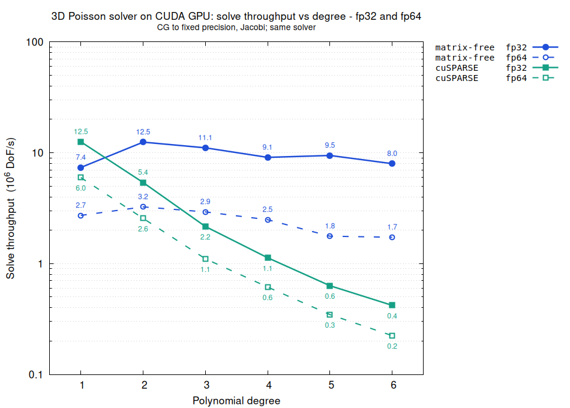

# CUDA / C++ Matrix-Free Solver Library designed for second-order PDE solved with FEM and with a PCG solver

## Description
This library provides a header-only, easy to use Matrix-Free CUDA / C++ PCG system solver.

## Typical use
The user provides the action of the FEM derived operator A over a solution vector u, at a quadrature point. The library handles the rest.

## Performance tests
With a 3D Poisson equation with homogeneous Dirichlet boundary conditions,  
we test the highly optimized cuSPARSE library against the matrix-free implementation:  
- we assemble the sparse matrix with cuSPARSE functions, and solve with the CUDA PCG solver written here (it is close to what Nvidia offers at their CUDALibrarySamples),  
- for the matrix-free version - obviously we never assemble the sparse matrix - and we solve with the exact same CUDA PCG solver,
- we compare the throughput of the whole solving of the equation,
- the experiment is run on a laptop with an RTX 4070 card.

#### Throughput for whole solver of Poisson 3D Equation (fp32 and fp64)

## Remark
- Code will be given only on demand

